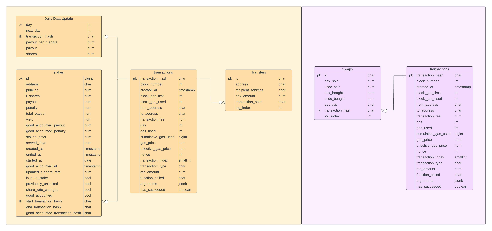

# Hexbase v.1

Run your own Hex cryptocurrency analytics platform: A Data Warehouse for exploring the Hex Cryptocurrency Data,
setting reminders for stakes, running your individual queries and more.

An ETL pipeline to load Hex cryptocurrency (https://hex.com) related data into a postgres DWH (Data-warehouse). 
Data Source is a full node of the ethereum blockchain.

## Entity Relationship Diagram

## Requirements
- run ethereum consensus & execution client locally
- PostgreSQL database
- 80Gb disk space
- 8GB RAM
- Core i7-10700 or stronger

## Recommendations
- visualisation open-source software for business intelligence: Metabase (recommendation). You can visualize queries from your Hexbase-Database.

## Configuration
Set up a local ethereum node and host a rpc connection on "http://localhost:8545".  
Additionally configure a file named "global_config.ini" and adjust the PATH_CONFIG in configs/credentials.py . 
The global_config.ini should look like this:

[postgre_db] 
dbname=your_db_name 
user=your_user 
password=your_password 
host=your_host 
port=your_port 

## Usage
Run the hex.py and uniswap_v2.py file periodically. (with cron jobs, jenkins, or etc.)

## Donations
Please donate if you want to support my current and future work! Thank you all! 
ETH Address:0x6E1e724b1e0227819e63E2bCB1a0E844dB60A9c3

## Features planned
- Support Hedron, Icosa, HSI, Maximus, Perpetual contracts
